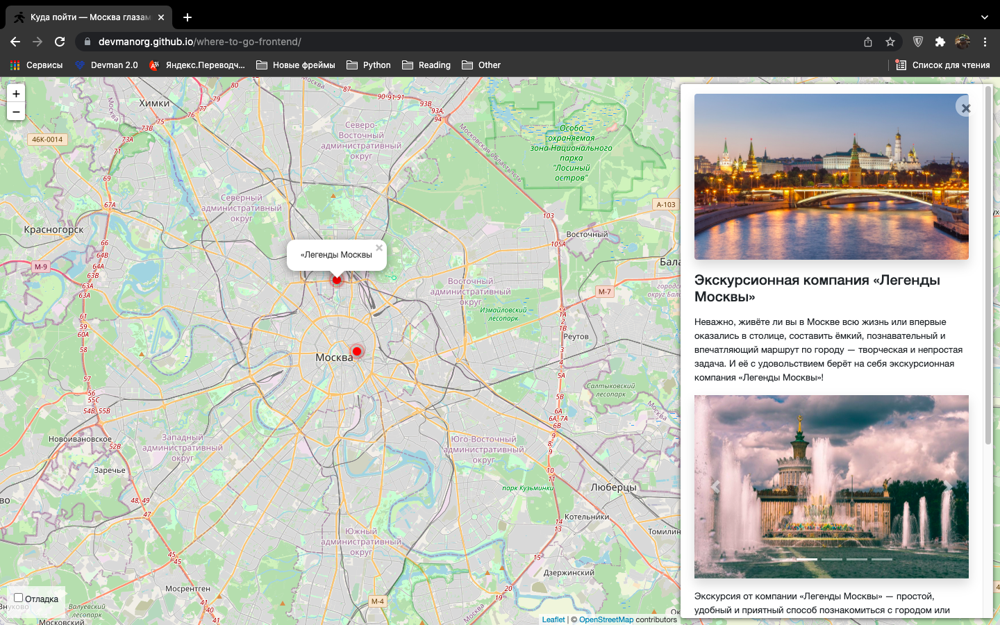

# Куда пойти — Москва глазами Артёма

Сайт с картой с интересными местами в Москве. На карте отображается маркеры, кликнув
по которым, можно получить полное описание места с фотографиями и полезными ссылками.



[Демка сайта](http://almen.pythonanywhere.com/).

## Как запустить

- Скачайте код
```bash
$ git clone https://github.com/Alex-Men-VL/where_to_go.git
$ cd where_to_go
```
- Установите зависимости:
```bash
$ pip install -r requirements.txt
```
- Накатите миграцию:
```bash
$ python3 manage.py migrate
```
- Запусти сервер:
```bash
$ python3 manage.py runserver
```

Чтобы открыть локальную версию сайта, перейдите по адресу `http://127.0.0.1:8000/`

## Переменные окружения

Часть данных берется из переменных окружения. Чтобы их определить, создайте файл 
`.env` рядом с `manage.py` и запишите туда данные в таком формате: 
`ПЕРЕМЕННАЯ=значение`

`SECRET_KEY` — секретный ключ Django;

`DEBUG` — режим отладки, по дефолту False;

`DB_ENGINE` - бэкенд вашей базы данных;

`DB_NAME` - имя бд;

## Используемые библиотеки

* [Leaflet](https://leafletjs.com/) — отрисовка карты
* [loglevel](https://www.npmjs.com/package/loglevel) для логгирования
* [Bootstrap](https://getbootstrap.com/) — CSS библиотека
* [Vue.js](https://ru.vuejs.org/) — реактивные шаблоны на фронтенде

## Цели проекта

Код написан в учебных целях — это урок в курсе по Python и веб-разработке на сайте [Devman](https://dvmn.org).

Тестовые данные взяты с сайта [KudaGo](https://kudago.com).

